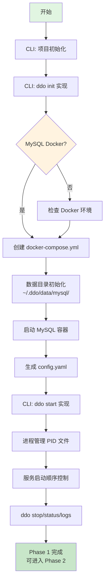
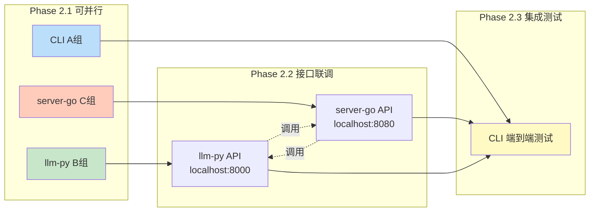
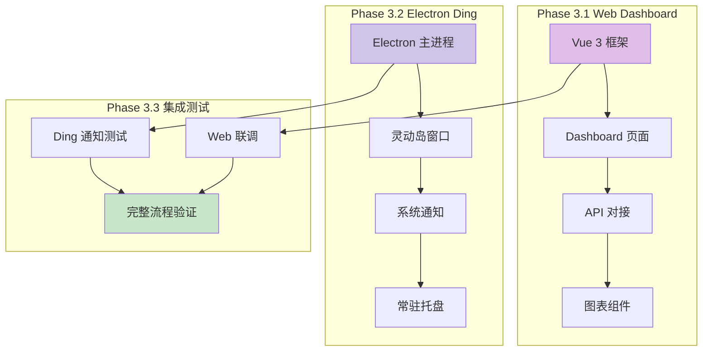
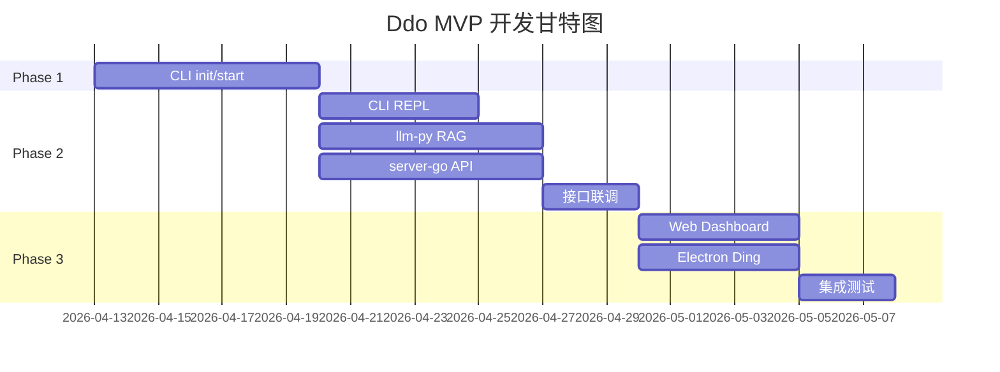

# Ddo 项目开发执行流程图

> 指导多模块并行开发的执行路线图
> 更新日期: 2026/04/13

---

## 一、架构总览

```
┌─────────────────────────────────────────────────────────────────────────┐
│                           开发阶段划分                                    │
├─────────────────────────────────────────────────────────────────────────┤
│                                                                         │
│  ┌──────────────┐     ┌──────────────┐     ┌──────────────┐            │
│  │   Phase 1    │────►│   Phase 2    │────►│   Phase 3    │            │
│  │  基础设施    │     │  核心能力    │     │  扩展完善    │            │
│  └──────────────┘     └──────────────┘     └──────────────┘            │
│        │                    │                    │                      │
│        ▼                    ▼                    ▼                      │
│   CLI + MySQL          RAG + API           Web + Ding                   │
│   (阻塞项，先完成)      (可并行开发)          (最后完善)                   │
│                                                                         │
└─────────────────────────────────────────────────────────────────────────┘
```

---

## 二、详细执行流程

### Phase 1: 基础设施（阻塞项 - 必须按序完成）



**关键检查点**:
- [ ] `ddo init` 成功创建目录结构和 MySQL 容器
- [ ] 数据持久化验证（删除容器后数据还在）
- [ ] `ddo start` 能启动 MySQL 并等待其就绪
- [ ] `ddo status` 正确显示 MySQL 运行状态

---

### Phase 2: 核心能力（可并行开发）

#### 2.1 并行小组划分

```
┌──────────────────────────────────────────────────────────────────────────┐
│                          Phase 2 并行开发                                 │
├──────────────────────────────────────────────────────────────────────────┤
│                                                                          │
│  ┌─────────────────┐  ┌─────────────────┐  ┌─────────────────┐           │
│  │    A组：CLI     │  │   B组：llm-py   │  │  C组：server-go │           │
│  │   服务管理      │  │    RAG Engine   │  │    API 网关     │           │
│  │   (阻塞依赖)    │  │   (相对独立)    │  │   (依赖 MySQL)  │           │
│  └────────┬────────┘  └────────┬────────┘  └────────┬────────┘           │
│           │                    │                    │                    │
│           │                    │                    │                    │
│  ┌────────▼────────┐  ┌────────▼────────┐  ┌────────▼────────┐          │
│  │ • ddo start     │  │ • FastAPI 框架  │  │ • Gin 框架      │          │
│  │   启动各类服务  │  │ • OpenRouter代理│  │ • MySQL 连接    │          │
│  │ • 进程守护      │  │ • RAG Engine:   │  │ • 健康检查      │          │
│  │ • REPL 基础     │  │   - Embedder    │  │ • 知识库 CRUD   │          │
│  │ • 配置管理      │  │   - Retriever   │  │ • 定时任务 API  │          │
│  │                 │  │   - Generator   │  │ • MCP 管理 API  │          │
│  │ 依赖: MySQL已启 │  │                 │  │                 │          │
│  │                 │  │ 依赖: 无(独立)  │  │ 依赖: MySQL已启 │          │
│  └─────────────────┘  └─────────────────┘  └─────────────────┘          │
│           │                    │                    │                    │
│           └────────────────────┼────────────────────┘                    │
│                                ▼                                         │
│                         ┌─────────────┐                                  │
│                         │  接口联调   │                                  │
│                         │  B组◄───►C组  │                                  │
│                         └─────────────┘                                  │
│                                                                          │
└──────────────────────────────────────────────────────────────────────────┘
```

#### 2.2 组间依赖关系



---

### Phase 3: 扩展层（最后完善）



---

## 三、执行检查清单

### Week 1: Phase 1 基础设施

| 天数 | 任务 | 负责 | 产出 | 检查点 |
|------|------|------|------|--------|
| Day 1-2 | CLI init | A组 | `ddo init` | 创建目录、MySQL 启动 |
| Day 3 | CLI start/stop | A组 | `ddo start/stop` | 进程管理、PID 文件 |
| Day 4 | CLI status/logs | A组 | `ddo status/logs` | 服务状态显示 |
| Day 5 | 数据持久化测试 | A组 | 测试报告 | 删除容器后数据还在 |
| Day 6-7 | 文档 & Bugfix | A组 | README | 可用性验证 |

### Week 2-3: Phase 2 核心能力（并行）

| 模块 | 功能点 | 负责 | 依赖 | 完成标准 |
|------|--------|------|------|----------|
| CLI | REPL 模式 | A组 | 无 | `/chat`、`/kb` 可用 |
| CLI | NLP 集成 | A组 | llm-py | 自然语言理解 |
| llm-py | RAG Engine | B组 | 无 | embed/search/ask 可用 |
| llm-py | OpenRouter | B组 | 无 | Chat API 转发 |
| server-go | 基础 API | C组 | MySQL | Health、CRUD |
| server-go | 定时任务 | C组 | MySQL | Cron 调度、HTTP 回调 |

### Week 4: Phase 3 扩展层

| 模块 | 功能点 | 负责 | 依赖 | 完成标准 |
|------|--------|------|------|----------|
| Web | Dashboard | D组 | server-go | 图表展示正常 |
| Web | 配置表单 | D组 | server-go | MCP/Timer 配置可用 |
| Electron | 主窗口 | E组 | 无 | 启动、托盘 |
| Electron | 灵动岛 | E组 | server-go | 定时任务弹窗 |

---

## 四、每日开发工作流

```
┌─────────────────────────────────────────────────────────────┐
│                     推荐开发工作流                           │
├─────────────────────────────────────────────────────────────┤
│                                                             │
│  1. 启动流程                                                │
│     ┌─────────────────────────────────────────────────┐    │
│     │ $ ddo init    # (首次) 或确认 MySQL 运行         │    │
│     │ $ ddo start   # 启动所有服务                     │    │
│     │ $ dding       # (可选) 启动灵动岛通知            │    │
│     └─────────────────────────────────────────────────┘    │
│                          │                                  │
│  2. 开发模式                                              │
│     ┌─────────────────────────────────────────────────┐    │
│     │ CLI 组: 直接 ./cli.js 或 npm run dev             │    │
│     │ llm-py: uvicorn app.main:app --reload           │    │
│     │ server-go: air (热重载)或 go run main.go        │    │
│     │ Web: npm run dev (Vite 热重载)                   │    │
│     └─────────────────────────────────────────────────┘    │
│                          │                                  │
│  3. 调试测试                                              │
│     ┌─────────────────────────────────────────────────┐    │
│     │ $ curl http://localhost:8080/health             │    │
│     │ $ ddo status                                    │    │
│     │ $ ddo logs [service]                            │    │
│     └─────────────────────────────────────────────────┘    │
│                          │                                  │
│  4. 停止清理                                              │
│     ┌─────────────────────────────────────────────────┐    │
│     │ $ ddo stop    # 停止所有服务                     │    │
│     │ $ ddo logs    # 查看错误日志                     │    │
│     └─────────────────────────────────────────────────┘    │
│                                                             │
└─────────────────────────────────────────────────────────────┘
```

---

## 五、代码提交规范

```
分支策略:

main (稳定分支)
  │
  ├── feature/cli-init      # CLI MySQL 管理
  │
  ├── feature/llm-rag       # llm-py RAG 能力
  │
  ├── feature/server-api    # server-go API
  │
  ├── feature/web-dashboard # Web 界面
  │
  └── feature/electron-ding # Electron 通知

提交信息格式:
  feat(cli): 实现 ddo init 命令，支持 MySQL Docker 启动
  feat(rag): 实现文档嵌入接口 /api/rag/embed
  fix(server): 修复 MySQL 连接池泄漏问题
  docs(readme): 更新部署文档
```

---

## 六、关键决策点



---

## 七、风险与应对

| 风险 | 可能性 | 影响 | 应对策略 |
|------|--------|------|----------|
| MySQL Docker 启动失败 | 中 | 高 | 提供详细错误日志，支持手动启动 |
| RAG 向量存储性能差 | 低 | 中 | 先用 Chroma，后期可切 Milvus |
| 跨平台兼容问题 | 中 | 中 | 早期在 Win/Mac 双环境测试 |
| OpenRouter 不稳定 | 中 | 中 | 支持配置备用模型 |

---

**下一步行动**: 确认 Phase 1 任务分配，开始 CLI `ddo init` 开发
